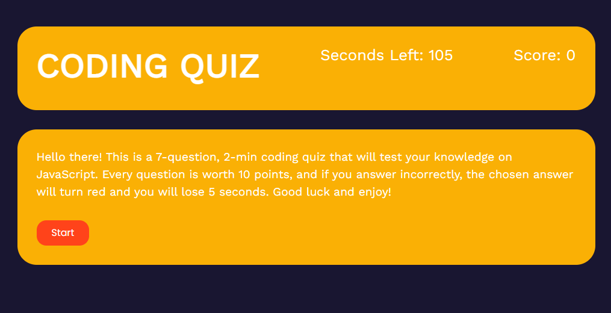
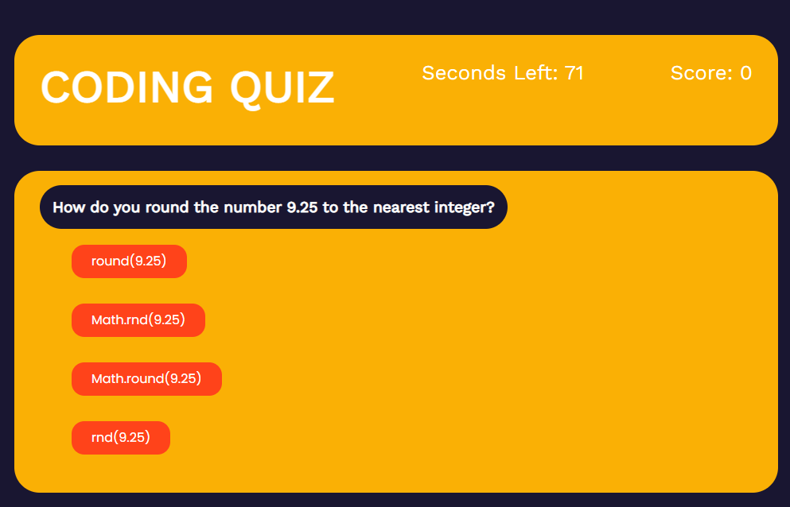
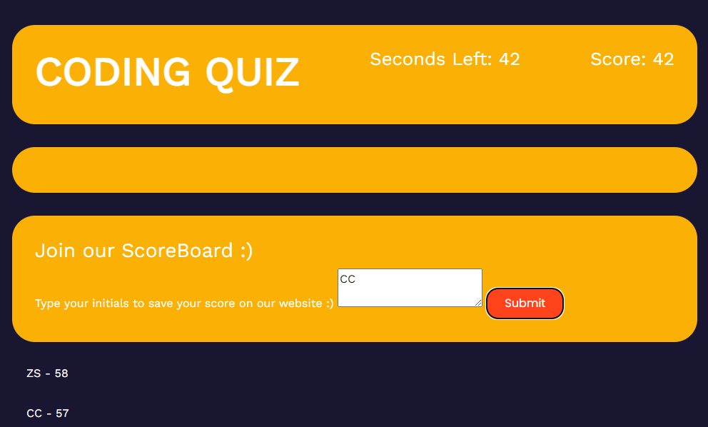

# Coding Quiz

Users will be first prompted to a title and instructions page. This quiz has 7 questions, and the user has 15 seconds to answer each. The timer begins at 105s and per each question answered incorrectly, the user will be subtracted 15 seconds. The user's final score will be the remaining amount of seconds left on the timer. Once all seven questions are answered, the user will be redirected to the final page where the user can input his or her initials and save their score.

## Technologies

This fun and interactive quiz was created using HTML, CSS, and JavaScript. Local storage was also incorporated so that the user can save their score and play the quiz as many times as wished and compared their scores with previous scores.

